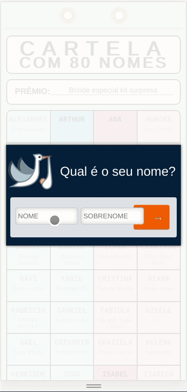

# Raffle
> Raffle for sweepstakes between friends and family .

With this raffle, you will be able to draw names, numbers or any string, you can also divide it into two columns, such as (man, woman) or leave only a single column.



## Installation

OS X & Linux:

```sh
npm install
```

## Usage example

OS X & Linux:

```sh
npm run dev
```

## Development setup

```sh
npm run production
```

## Meta

Leandro Carra – [@leandrotoco](https://twitter.com/leandrotoco)


[https://github.com/yourname/leandrocarra](https://github.com/leandrocarra)
